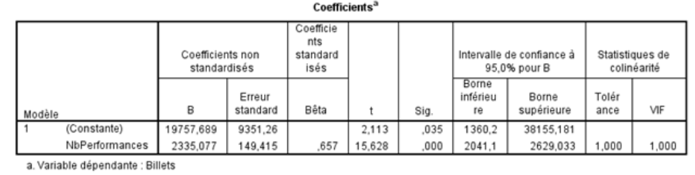

Ce troisième devoir a été réalisé avec la base de données Devoir3_Cirque.sav et l'analyse a été faite avec Rstudio. Ce présent document .docx a été produit à l'aide de RStudio et le R markdown. 

**************************************

# **Partie 1**
*On essaie de créer un modèle simple pour prévoir le nombre de billets vendus. On utilise les figures 1 à 5, qui était fourni dans l'énoncé.*


## Numéro 1  
*Commencez par une brève analyse descriptive des 4 variables concernées. **Ne faites pas de rédaction** , ne faites qu'examiner les sorties, elles pourraient vous être utiles pendant les analyses.*

Voir la **figure 1**.

## Numéro 2  
*Parmi les variables NombreJoursVente , NbPerformances et Marketing , laquelle semble avoir le lien le plus fort avec le nombre de billets vendus ? Justifiez.*

On peut voir d'après la **Figure 2**, que la variable "NbPerformances" semble être la variable qui influence le plus la vente de billets. En effet, avec un coefficient de 0.657 on peut dire que la corrélation semble *forte*.  
  


## Numéro 3  
*Est-ce que le lien entre le nombre de billets vendus et la variable identifiée en 2 semble linéaire ? Justifiez.*

Cependant, il est essentiel de faire une analyse visuelle du graphique de la relation pour s'assurer que leur lien est bel et bien linéaire. Avec la **Figure 3**, on constate que le graphique "Nb de performances - Billets" est celui qui se rapproche effectivement le plus d'un modèle linéaire.  
  
On peut aussi remarquer que le graphique "Nb jour de vente - Billets" semble complètement éparpiller au centre du graphique et le graphique "Total marketing - Billets" semble avoir des "strates" ce qui semble suggérer un modèle assez compliquer pour le marketing. 


## Numéro 4  
*Quelle proportion de la variation du nombre de billets vendus est expliquée par la variable identifiée en 2 ?*

Soit le coefficient R = 0.657, on peut déterminer que 

``` {r}
R = 0.657
R2 = R * R 
print(R2*100)

```
Donc, le R² nous indique que 43.1649% de la variation du nombre du nombre de billets vendus est représenté par le nombre de représentation. 

## Numéro 5 
*Écrivez l'équation de la droite de régression qui a la variable identifiée en 2 comme variable explicative, et interprétez-la.*


ŷ~billets vendus~ = b~0~ + b~1~ X~NbRepresentation~ = 19757.689 + 2335.077 X~NbRepresentation~


Voir la **figure 4**. 

Cette équation détermine le nombre de billets qu'on pourrait selon le nombre de représentation. On peut voir que dans le cas ou le nombre de représentation serait 0, il y aurait quand même 19575 billets de vendu. Ceci est insensé. On pourrait penser que cette erreur est du qu'il y a toujours au moins 19575 billets qui seraient vendu pour chaque "run" à des fidèles clients qui vont à tout les "runs". 

## Numéro 6
*Utilisez l'équation écrite en 5 pour prévoir le nombre de billets vendus lorsque la variable explicative a une valeur de 150.*
Soit :  
ŷ~billets vendus~ = b~0~ + b~1~ X~NbRepresentation~ = 19757.689 + 2335.077 X~NbRepresentation~
  
On pourrait donc prévoir que si le Cirque décide de faire 150 représentations, le nombre de billets vendu serait déterminer par l'équation suivante : 
```{r}
y = (19757.689 + 2335.077 * 150)
print(y)

```

********************************

# **Partie 2**
*On cherche un modèle pour prévoir le nombre de billets vendu par années. On commence alors à faire une régression linéaire multiple à 4 variables : NombreJoursVente, NbPerformances , LongTermOrientation et AppreciationShow. Le seuil de confiance de la partie 2 sera de 0,05*

## Numéro 1  
*Générez et fournissez les statistiques descriptives des variables AppreciationShow et LongTermeOrientation. **Ne faites aucune rédaction**, ne faites qu'examiner cette sortie, elle pourrait vous être utile pendant les analyses.*

Voir **Figure 5**. Il est important de noter qu'il y a 8 valeurs NULL dans la colonne "LongTermeOrientation".

## Numéro 2  
*Générez (et fournissez) toutes les sorties du modèle de régression linéaire multiple avec les quatre variables explicatives, incluant les sorties concernant les résidus, et sauvegardez les résidus standardisés (ceci est nécessaire pour produire le test de normalité, qui fait partie des sorties concernant les résidus).*

Voir **Figure 6 et 7**

## Numéro 3  
*Procédons maintenant à l'analyse et l'utilisation du modèle généré en 2 :*

### (a)  
*Faites l'analyse de la validité de ce modèle.*

Pour faire l'analyse de la validité, nous allons vérifier les 3 aspects suivant : la taille de l'échantillon, la similarité des variables explicatives et les erreurs d'estimations.  

**Voir la figure 7**

1. La taille de l'échantillon est suffisante étant donnée que dans la variable "LongTermeOrientation" est celle avec le moins de résultat valide et celle-ci regroupe 315 observations : 

```
n = 315 > 10*4 = 40

```

2. Les valeurs du VIF nous permet de constater qu'il n'y a pas de problème de multicolinéarité dans ce modèle puisque le plus grand des VIF est de 1.362140. Donc les analyses faites à partir de la table des coefficients ne sont pas affectée par un problème de multicolinéarité. Elles peuvent être considérées valide si le modèle semble assez valide et performant pour être utilisé. 


3. On utilise le test de normalité pour tester ces hypothèses :   

H~0~ : Au niveau de la population, les résidus se distribuent selon une loi normale.  
H~1~ : Au niveau de la population, les résidus ne se distribuent pas selon une loi normale.  

Étant donné qu'au moins une des 2 valeur de P est suppérieur au seuil de 0,05, on conserve H~0~ . On considère donc que les données se distribuent selon une loi normale. Cette dernière considération nous permet d'assurer l'inférence  faite à partir de ce modèle. 

Il ne reste qu'à évaluer le graphique des résidus. 

Avec une analyse visuelle du graphique, les points sembles assez aléatoire autant en haut qu'en bas de la ligne du centre. On ne peut pas y percevoir une courbe ou de variance. On peut voir qu'il y a une valeur qui dépasse un peu 3x la valeur de l'écart type.


### (b)  
*Du point de vue de l'explication de la variation du nombre de billets vendus, quel est le gain de ce modèle relativement à celui étudié à la partie 1 ?*  

Il permet une plus grande précision étant donné le R^2 plus important dans la partie 2 qui représente 56,02% de la variation du nombre de billets au lieu du R^2 de la première partie qui était de 43.16%. Nous pouvons donc affirmer avoir un gain de  12,86% avec la partie 2 du travail. 


### (c)  
*Est-ce que cette régression multiple est significative ? Rédigez tous les détails pour répondre à cette question.*

La table Anova nous permet de déterminer si : 

H~0~ : La régression est non significative dans la population.  
H~1~ : La régression est significative dans la population.  

Étant donné qu'ils ont tous une signification de 0 dans la table anova, ce qui est moindre que notre seuil de 0,05, on rejette H~0~ au risque de se tromper 1 fois sur 20. On conclut donc que la régression est significative.   


###(d)  
*Écrivez l'équation du modèle, et interprétez-la. Est-il possible d'interpréter la constante en tant que prévision du modèle ? Justifiez.*


ŷ = -111178.10 + 301.04 X~NombreJoursVente~ + 1977.64 X~NbPerformances~ + 712.54 X~LongTermOrientation~ + 8541.68 X~AppreciationShow~    

Cette formule issue de notre tableau des Coefficients, représente le nombre de billets vendu en fontionc du nombre de jour de ventes, du Nombre de Performances, de l'Orientation à long terme et de l'appreciation du Show. La valeur nulle pour chacune des variables n'est pas possible. En effet comment pourrait t'on avoir un show qui n'a aucune performance, par exemple.   

Pour B~0~, la constante est de -111178.10.  il ne serait pas possible de vendre un nombre de billets négatif, donc pour que la formule soit applicable, il faut avoir une nombre assez élevé dans chacun des autres variables. Il y a 95% des chances que cette valeur se situe entre -151626.4356 et -70729.7572.  

Pour B~1~, on peut voir que le fait d'ajouter une journée de vente pour un show permet d'augmenter les ventes de 301,04 billets. Il y a 95% des chances que cette valeur se situe entre 115.0489 et 487.0367. Cette variable est certainement la moins couteuse modifier, étant donné les faibles coûts d'ajouter une journée de vente, comparativement à ajouter une représentation.   

Pour B~2~, on peut voir que chaque performance additionnel permet d'augmenter les ventes vendus de 1977.64 billets. Il y a 95% des chances que cette valeur se situe entre 1676.0306 et 2279.2566. Cette variable permet facilement d'augmenter le nombre de billets vendus, cependant dans une optique business, il faudrait vérifier que les 1977 billets peuvent payer pour les frais additionnels d'une représentation de plus.   

Pour B~3~, on peut voir que chaque points additionnel dans l'orientation long terme permet d'augmenter les ventes vendus de 712.54 billets. Il y a 95% des chances que cette valeur se situe entre 524.0725 et 901.0034.  

Pour B~4~, on peut voir que chaque points additionnel sur l'appreciation d'un show permet d'augmenter les ventes vendus de 8541.68 billets. Il y a 95% des chances que cette valeur se situe entre 5698.6071 et 11384.7514. Cette valeur étant sur 10, il risque d'être difficile de se concentrer seulement sur cette variable pour augmenter les ventes de billets.   


###(e)  
*Estimez ponctuellement et par intervalle de confiance de niveau 95 % le nombre de billets vendus en moyenne pour des runs ayant 100 performances, ayant obtenu une appréciation moyenne de 8 sur 10 , dont les billets ont été en vente pendant 125 jours, et dans une région ayant un score de 60 pour le Long Term Orientation. Il n'est pas obligatoire de fournir une capture d'écran.*


``` {r}
y = -111178.10 + 301.04 * 125 + 1977.64 * 100 + 712.54* 60 + 8541.68 * 8
print(y)

```

### (f)  
*Calculez le MAD et le MAPE de ce modèle, et interprétez-les (simplement expliquer ce qu'ils signifient).*

Lindice de perfomance MAD permet de mesurer l'ampleur de l'erreur d'un modèle statistique. 


### (g) (Bonus)   
*Supposons que ce modèle soit jugé assez précis pour qu'un gestionnaire décide de l'utiliser afin de prévoir combien de billets pourront être vendus pour une run qui commence dans deux mois. Pensez-vous que ce modèle pourra être utilisé tel quel ? Justifiez.*

Non. Pas pour dans 2 mois, car selon mes estimés, la méthode la plus sure pour augmenter le nombre de billets vendus et surtout les revenues seraient d'ouvrir la vente beaucoup plus tôt que seulement 2 mois en avance. 

*****************************

## Figure 1

```{r echo=FALSE}
# Fonctions utilisées
 source('Devoir3_Sorties.R', encoding = 'UTF-8')
#  source('/home/vincent/Github/mqg811/Devoir3/Devoir3_Sorties.R', encoding = 'UTF-8')
  print("Statistique descritive")
  numero1()


```

## Figure 2

 
```{r echo=FALSE}
# Fonctions utilisées
 #source('~/Rstudio/STT811/mqg811/Devoir3/Devoir3_Sorties.R', encoding = 'UTF-8')
#  source('/home/vincent/Github/mqg811/Devoir3/Devoir3_Sorties.R', encoding = 'UTF-8')
 correlation()
  
```


## Figure 3
```{r echo=FALSE}
# Fonctions utilisées
 #source('~/Rstudio/STT811/mqg811/Devoir3/Devoir3_Sorties.R', encoding = 'UTF-8')
#  source('/home/vincent/Github/mqg811/Devoir3/Devoir3_Sorties.R', encoding = 'UTF-8')
  numero2(1)
  numero2(2)
  numero2(3) 
  
```

## Figure 4

Coefficients : 


## Figure 5
```{r echo=FALSE}
# Fonctions utilisées
# source('~/Rstudio/STT811/mqg811/Devoir3/Devoir3_Sorties.R', encoding = 'UTF-8')
#  source('/home/vincent/Github/mqg811/Devoir3/Devoir3_Sorties.R', encoding = 'UTF-8')
  statsDescPart2()

```

## Figure 6
```{r echo=FALSE}
# Fonctions utilisées
# source('~/Rstudio/STT811/mqg811/Devoir3/Devoir3_Sorties.R', encoding = 'UTF-8')
#  source('/home/vincent/Github/mqg811/Devoir3/Devoir3_Sorties.R', encoding = 'UTF-8')
  correlation2()
```


## Figure 7
```{r echo=FALSE}
# Fonctions utilisées
# source('~/Rstudio/STT811/mqg811/Devoir3/Devoir3_Sorties.R', encoding = 'UTF-8')
#  source('/home/vincent/Github/mqg811/Devoir3/Devoir3_Sorties.R', encoding = 'UTF-8')
  stats()
```

